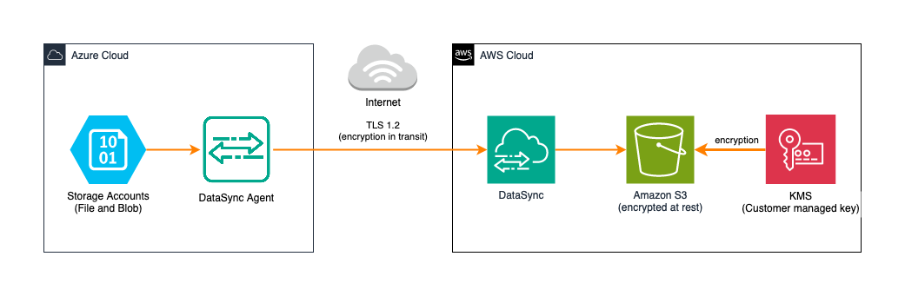

# Azure Storage Account Backup to S3 with DataSync

This project facilitates the migration of data from Azure Blob and File Storage to Amazon S3 using AWS DataSync. The primary motivation for this project stems from a customer requirement for an additional, secure backup system on a different cloud provider. This enhances data availability and security by ensuring redundancy and preventing any single point of failure.



## Initialize

1. Create a Bucket for the terraform backend
2. Copy `s3.tfbackend.example` and rename it to `s3.tfbackend`
3. Add the backet name to `s3.tfbackend`
4. Add your prefered region
5. Run the following:

```bash
terraform init -backend-config=s3.tfbackend
```

## Deploy

1. Copy the content from `terraform.tfvars.examples` and rename it to `terraform.tfvars` and set your variables.
2. Copy the `storage_accounts.tfvars.example` and rename it to `storage_accounts.tfvars` and populate your storage accounts to it.
3. Make sure the agent is up and running
4. Deploy with:

```bash
terraform apply -var-file="terraform.tfvars" -var-file="storage_accounts.tfvars"
```

## Manual Key Rotation

Check out this guide: https://repost.aws/knowledge-center/rotate-keys-customer-managed-kms
